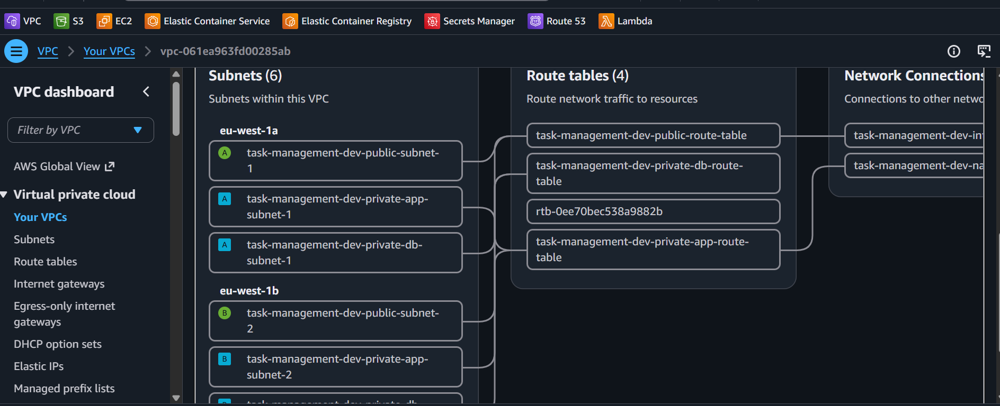
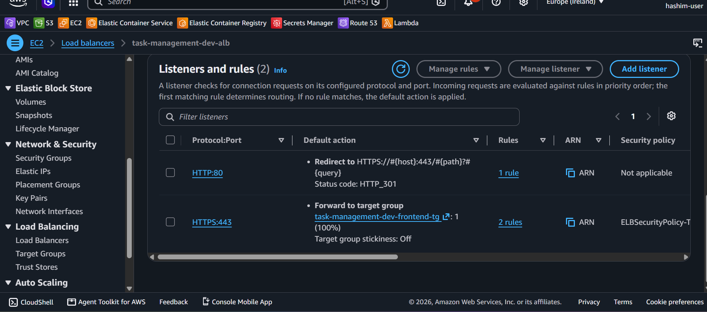
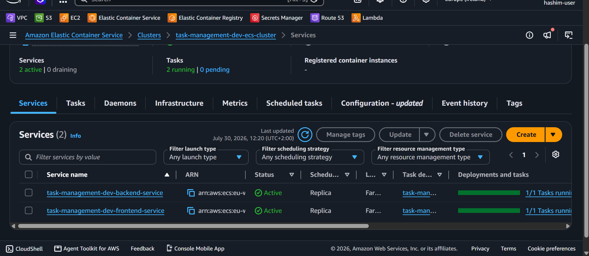
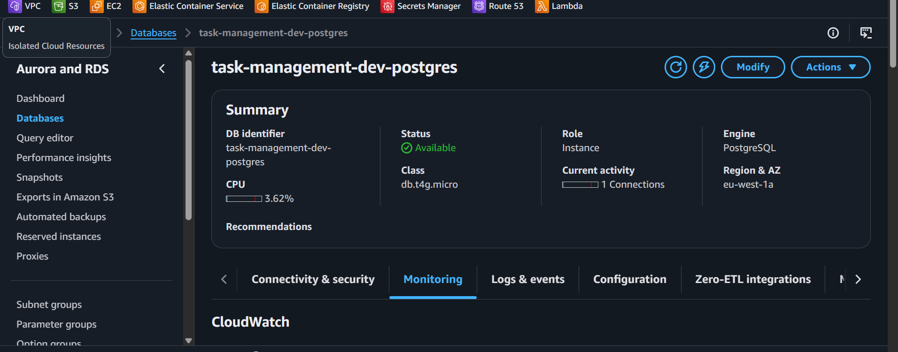
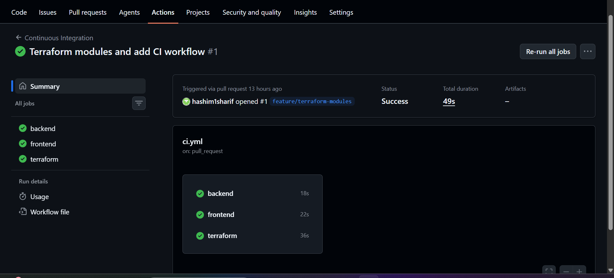
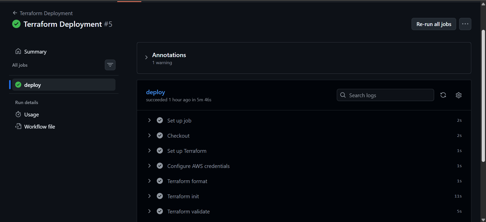
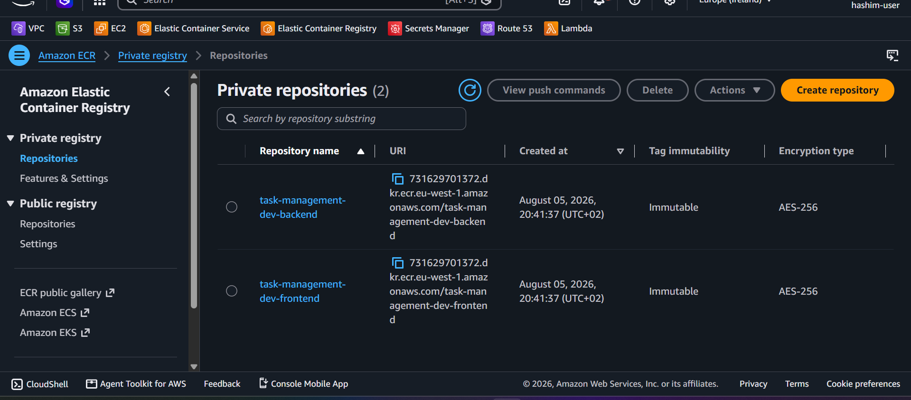
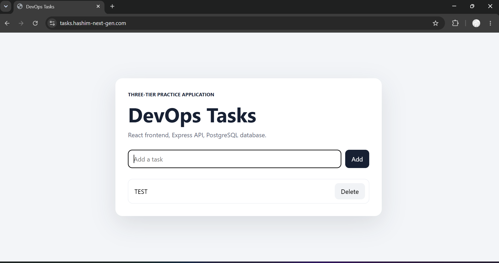
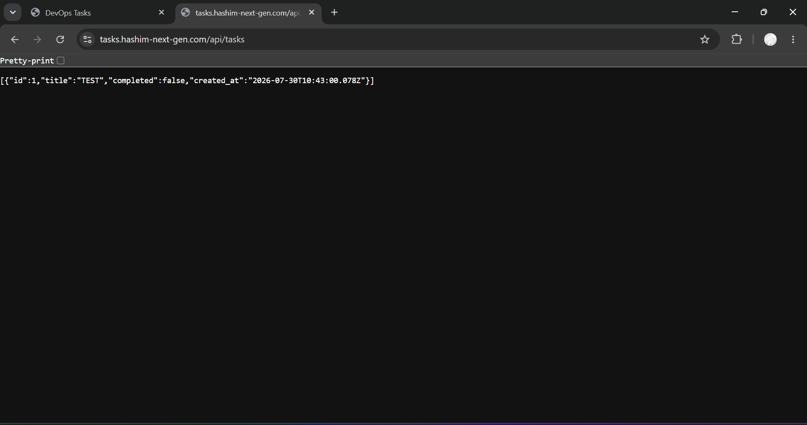

# Task Management Platform on AWS

[](https://github.com/hashim1sharif/task-management-platform/actions/workflows/ci.yml)
[](https://github.com/hashim1sharif/task-management-platform/actions/workflows/terraform-deploy.yml)
[](https://github.com/hashim1sharif/task-management-platform/actions/workflows/application-deploy.yml)

A three-tier task-management application deployed on AWS with Docker, Amazon ECS Fargate, Amazon RDS, Terraform, and GitHub Actions.

My work focused on the DevOps platform: containerization, AWS infrastructure, networking, security, HTTPS, logging, remote Terraform state, and CI/CD.

**Live application:** [https://tasks.hashim-next-gen.com](https://tasks.hashim-next-gen.com)

> The development environment may be stopped when it is not in use to reduce AWS costs.

## Application overview

The application allows users to create, view, and delete tasks through a web interface.

It has three layers:

- **Frontend:** React and Vite, served by Nginx
- **Backend:** Node.js and Express REST API
- **Database:** PostgreSQL on Amazon RDS

The frontend and backend are built as separate Docker images and stored in separate Amazon ECR repositories.

### Why this application?

I chose a task-management application because it is simple to understand but still represents a realistic three-tier workload.

It requires:

- A separate frontend and backend
- Persistent database storage
- Container networking
- Secure database access
- Load balancing
- HTTPS
- Secrets management
- Logging
- Infrastructure as Code
- Automated deployments

The main focus of this project is the AWS platform and deployment process around the application.

### Why Amazon ECS Fargate?

I chose Amazon ECS Fargate because I do not need to manage the underlying container servers.

With Fargate:

- I do not patch or maintain EC2 container hosts
- The frontend and backend run as separate services
- Each service can be deployed and scaled independently
- It integrates with Amazon ECR, ALB, IAM, CloudWatch, and RDS
- It reduces infrastructure maintenance

A normal virtual machine could run the application, but it would require operating-system updates, Docker management, capacity planning, and server maintenance.

Vercel or Netlify could host the frontend, but they would not demonstrate the complete AWS platform used in this project, including ECS, ECR, private backend networking, RDS, IAM, ALB routing, Route 53, ACM, Terraform, and GitHub OIDC.

### Expected users

This is a development and portfolio environment for a small team and low-to-moderate traffic.

A reasonable first estimate is **10 to 50 users**, not all active at the same time. This is not a tested capacity limit.

The current environment uses:

```text
Frontend service: 1 ECS task
Backend service:  1 ECS task
Database:         db.t4g.micro
```

Before production use, I would run load tests, add CloudWatch alarms, configure ECS Service Auto Scaling, and review the RDS instance size.

## Architecture


```text
Browser
  │
  ▼
Route 53
  │
  ▼
Internet-facing Application Load Balancer
  ├── HTTP :80      → Redirect to HTTPS :443
  ├── HTTPS /       → Frontend ECS :8080 in public subnets
  └── HTTPS /api/*  → Backend ECS :5000 in private application subnets
                              │
                              ▼
                    RDS PostgreSQL :5432 in private database subnets
```

### Network design

- The frontend service runs in public subnets
- Frontend tasks receive public IP addresses
- The ALB forwards frontend traffic to container port `8080`
- The frontend accepts port `8080` only from the ALB security group
- The backend service runs in private application subnets without public IP addresses
- The ALB forwards API traffic to backend port `5000`
- Private application subnets use a NAT Gateway for outbound access
- Amazon RDS runs in private database subnets
- The database accepts port `5432` only from the backend security group

## What I built

- React frontend served by Nginx
- Node.js and Express REST API
- PostgreSQL database on Amazon RDS
- Separate frontend and backend Docker images
- Separate immutable Amazon ECR repositories
- Frontend ECS Fargate service in public subnets
- Backend ECS Fargate service in private application subnets
- Internet-facing Application Load Balancer
- HTTP-to-HTTPS redirection
- Path-based routing for `/api/*`
- HTTPS with Route 53 and AWS Certificate Manager
- CloudWatch log groups for both services
- Reusable Terraform modules
- Remote Terraform state in Amazon S3
- GitHub Actions for CI and deployment
- GitHub OIDC authentication without permanent AWS access keys

## Technology stack

| Area | Technology |
|---|---|
| Frontend | React, Vite, Nginx |
| Backend | Node.js, Express |
| Database | Amazon RDS for PostgreSQL |
| Containers | Docker |
| Container platform | Amazon ECS Fargate |
| Container registry | Amazon ECR |
| Infrastructure as Code | Terraform |
| Networking | Amazon VPC, subnets, route tables, Internet Gateway, NAT Gateway, security groups |
| Traffic management | Application Load Balancer |
| DNS and HTTPS | Amazon Route 53, AWS Certificate Manager |
| Secrets | AWS Secrets Manager |
| Logging | Amazon CloudWatch Logs |
| CI/CD | GitHub Actions |
| AWS authentication | GitHub OIDC and IAM |

## Repository structure

```text
task-management-platform/
├── .github/
│   └── workflows/
│       ├── ci.yml
│       ├── terraform-deploy.yml
│       ├── application-deploy.yml
│       └── terraform-destroy.yml
├── backend/
│   ├── src/
│   ├── Dockerfile
│   └── package.json
├── frontend/
│   ├── src/
│   ├── Dockerfile
│   └── package.json
├── infra/
│   └── terraform/
│       ├── bootstrap/
│       ├── environments/
│       │   └── dev/
│       └── modules/
│           ├── acm/
│           ├── alb/
│           ├── ecr/
│           ├── ecs/
│           ├── network/
│           ├── rds/
│           ├── route53/
│           └── security/
├── docs/
│   ├── architecture-diagram.gif
│   ├── RUNBOOK.md
│   ├── SCREENSHOTS.md
│   ├── aws-environment-plan.md
│   └── screenshots/
├── docker-compose.yaml
└── README.md
```

## Infrastructure design

The Terraform code is divided into reusable modules.

| Module | Responsibility |
|---|---|
| `network` | VPC, subnets, route tables, Internet Gateway, and NAT Gateway |
| `security` | Security groups and traffic rules |
| `ecr` | Frontend and backend repositories |
| `rds` | PostgreSQL database and database subnet group |
| `alb` | Load balancer, listeners, target groups, and routing |
| `ecs` | Cluster, task definitions, services, IAM role, and log groups |
| `acm` | TLS certificate and DNS validation |
| `route53` | DNS alias record |

Terraform state is stored remotely in Amazon S3 with native S3 state locking.

The bootstrap configuration creates the remote-state S3 bucket and the Terraform GitHub Actions IAM role.

## Security

- Public HTTP traffic is redirected to HTTPS
- The ALB is the only component that accepts public inbound traffic
- The frontend accepts port `8080` only from the ALB security group
- The backend has no public IP address
- Amazon RDS is not publicly accessible
- The database accepts PostgreSQL traffic only from the backend security group
- Database credentials are managed through AWS Secrets Manager
- GitHub Actions uses OIDC instead of permanent AWS access keys
- Separate IAM roles are used for Terraform and application deployment
- Docker images are tagged with the Git commit SHA
- Local secret files remain outside Git

## CI/CD

### Continuous Integration

The CI workflow checks the backend, frontend, Docker builds, and Terraform configuration.

```text
Backend:   npm ci → syntax check → Docker build
Frontend:  npm ci → production build → Docker build
Terraform: format check → init without backend → validate
```

Workflow: [`.github/workflows/ci.yml`](.github/workflows/ci.yml)

### Terraform Deployment

The Terraform deployment workflow is started manually.

```text
Checkout
→ Configure AWS credentials with OIDC
→ Terraform format
→ Terraform init
→ Terraform validate
→ Terraform plan
→ Terraform apply
```

Workflow: [`.github/workflows/terraform-deploy.yml`](.github/workflows/terraform-deploy.yml)

### Application Deployment

The application deployment workflow is started manually after the infrastructure exists.

It:

1. Builds the frontend and backend images
2. Tags both images with the Git commit SHA
3. Pushes both images to Amazon ECR
4. Creates new ECS task-definition revisions
5. Updates both ECS services
6. Scales both services to one task
7. Waits until the services are stable

Workflow: [`.github/workflows/application-deploy.yml`](.github/workflows/application-deploy.yml)

### Terraform Destroy

The destroy workflow is started manually and requires `DESTROY` as confirmation.

Workflow: [`.github/workflows/terraform-destroy.yml`](.github/workflows/terraform-destroy.yml)

## Deployment overview

### First deployment

1. Create the bootstrap resources
2. Run **Terraform Deployment**
3. Terraform creates the AWS infrastructure and ECR repositories
4. ECS services are created with zero running tasks
5. Run **Application Deployment**
6. The workflow pushes the first images and starts both ECS services
7. Verify the application, API, target groups, and logs

### Later infrastructure changes

Update the Terraform code, merge it into `main`, and run **Terraform Deployment**.

### Later application changes

Update the application code, merge it into `main`, and run **Application Deployment**.

The full deployment and operational steps are documented in [`docs/RUNBOOK.md`](docs/RUNBOOK.md).

## Local development

### Requirements

- Git
- Docker Desktop
- Docker Compose

Start the application:

```bash
docker compose up --build
```

Stop the application:

```bash
docker compose down
```

## Terraform commands

From the repository root:

```bash
terraform fmt -check -recursive infra/terraform
```

Open the development environment:

```bash
cd infra/terraform/environments/dev
```

Initialize and validate:

```bash
terraform init
terraform validate
```

Create and apply a saved plan:

```bash
terraform plan -out=tfplan
terraform apply tfplan
```

Destroy the development environment:

```bash
terraform plan -destroy -out=destroy.tfplan
terraform apply destroy.tfplan
```

## Project evidence

### AWS network

The VPC contains public, private application, and private database subnets across two Availability Zones.



### Application Load Balancer

Port `80` redirects to HTTPS on port `443`. The HTTPS listener routes frontend and API traffic to separate target groups.



### ECS Fargate services

Both ECS services are active with one running task.



### PostgreSQL database

Amazon RDS for PostgreSQL is available on a `db.t4g.micro` instance.



### Continuous Integration

The CI workflow completed successfully for the backend, frontend, and Terraform jobs.



### Terraform Deployment

The Terraform deployment workflow completed successfully.



### Amazon ECR

The frontend and backend use separate immutable ECR repositories.



### Live application

The application is available through HTTPS.



### API response

The backend API is available through `/api/tasks`.



The complete screenshot gallery is available in [`docs/SCREENSHOTS.md`](docs/SCREENSHOTS.md).

## Key decisions

- Used separate public, application, and database network layers
- Kept the backend and database without direct public access
- Used one ALB for frontend and API routing
- Used two ECS services for independent deployment
- Used zero-task ECS services during the first Terraform deployment
- Used Git commit SHA image tags for traceable releases
- Separated infrastructure deployment from application deployment
- Used GitHub OIDC instead of permanent AWS credentials
- Stored Terraform state remotely with S3 locking

## Possible improvements

- Add automated tests
- Add image and dependency scanning
- Add CloudWatch alarms and dashboards
- Add ECS Service Auto Scaling
- Add staging and production environments
- Add load testing
- Add database backup and restore testing
- Add AWS cost alerts

## Documentation

- [Deployment and operations runbook](docs/RUNBOOK.md)
- [Screenshot gallery](docs/SCREENSHOTS.md)
- [AWS environment plan](docs/aws-environment-plan.md)

## Author

**Hashim Sharif**

DevOps and cloud engineering portfolio project focused on AWS, Terraform, Docker, networking, security, and CI/CD.
