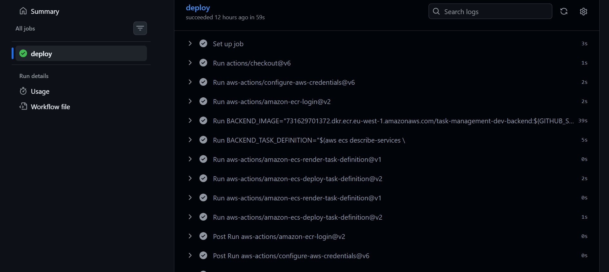

# Task Management Platform on AWS

[](https://github.com/hashim1sharif/task-management-platform/actions/workflows/ci.yml)
[](https://github.com/hashim1sharif/task-management-platform/actions/workflows/deploy-dev.yml)

I built this project to practise taking a three-tier application from a local Docker setup to a complete AWS deployment.

The frontend and backend run as separate containers on Amazon ECS Fargate. PostgreSQL runs on Amazon RDS, and an Application Load Balancer handles both the website and API traffic. The infrastructure is managed with Terraform, while GitHub Actions builds and deploys new application versions.

**Live environment:** `https://tasks.hashim-next-gen.com`

> The development environment may be destroyed when it is not being used to reduce AWS costs.

## Architecture

Add your own exported diagram here:

```markdown

```


The main request flow is:

```text
User
  → Route 53
  → HTTPS Application Load Balancer
  → Frontend ECS service
  → /api/* through the load balancer
  → Backend ECS service
  → RDS PostgreSQL
```

The frontend and backend tasks run in private application subnets. The database runs in private database subnets and accepts PostgreSQL traffic only from the backend security group.

## What I built

- A React frontend served by Nginx
- A Node.js and Express REST API
- A PostgreSQL database on Amazon RDS
- Separate frontend and backend Docker images
- Separate Amazon ECR repositories with immutable image tags
- Two ECS Fargate services in private subnets
- An internet-facing Application Load Balancer
- Path-based routing for `/api/*`
- HTTPS using Route 53 and AWS Certificate Manager
- CloudWatch log groups for both services
- Reusable Terraform modules
- GitHub Actions for CI and automated deployment
- GitHub OIDC authentication without permanent AWS access keys

## Technology stack

| Area | Technology |
|---|---|
| Frontend | React, Vite, Nginx |
| Backend | Node.js, Express |
| Database | PostgreSQL on Amazon RDS |
| Containers | Docker |
| Container platform | Amazon ECS Fargate |
| Container registry | Amazon ECR |
| Infrastructure | Terraform |
| Networking | VPC, public and private subnets, NAT Gateway, security groups |
| Traffic | Application Load Balancer |
| DNS and HTTPS | Route 53 and AWS Certificate Manager |
| Logging | Amazon CloudWatch Logs |
| CI/CD | GitHub Actions |
| AWS authentication | GitHub OIDC and IAM |

## Repository structure

```text
task-management-platform/
├── .github/
│   └── workflows/
│       ├── ci.yml
│       └── deploy-dev.yml
├── backend/
│   ├── src/
│   ├── Dockerfile
│   └── package.json
├── frontend/
│   ├── src/
│   ├── Dockerfile
│   └── package.json
├── infra/
│   └── terraform/
│       ├── bootstrap/
│       ├── environments/
│       │   └── dev/
│       └── modules/
├── docs/
│   ├── RUNBOOK.md
│   ├── SCREENSHOTS.md
│   └── screenshots/
├── docker-compose.yml
└── README.md
```

## Infrastructure design

The Terraform code is split into modules so each part has one clear responsibility.

| Module | Responsibility |
|---|---|
| `network` | VPC, subnets, routes, Internet Gateway and NAT Gateway |
| `security` | Security groups for the ALB, ECS services and database |
| `ecr` | Frontend and backend repositories |
| `rds` | PostgreSQL database and database subnet group |
| `alb` | Load balancer, listeners, target groups and routing rules |
| `ecs` | Cluster, task definitions, services, IAM roles and log groups |
| `acm` | TLS certificate and DNS validation |
| `route53` | DNS alias record for the application |

The Terraform state is stored remotely in Amazon S3 with the native S3 lockfile enabled.

## Security choices

- Only the Application Load Balancer is publicly reachable.
- ECS tasks do not receive public IP addresses.
- RDS is not publicly accessible.
- The frontend accepts traffic only from the ALB.
- The backend accepts application traffic only from the ALB.
- RDS accepts port `5432` only from the backend security group.
- Database credentials are stored in AWS Secrets Manager.
- GitHub Actions uses temporary AWS credentials through OIDC.
- Docker images are tagged with the Git commit SHA.
- Sensitive local files such as `terraform.tfvars` and `.env` are not committed.

## CI/CD

### Continuous integration

The CI workflow runs checks for the backend, frontend and Terraform configuration.

```text
Backend: npm install → syntax check → Docker build
Frontend: npm install → production build → Docker build
Terraform: format check → initialization without backend → validation
```

Workflow file: `.github/workflows/ci.yml`

### Deployment

After changes reach `main`, the deployment workflow:

1. Authenticates to AWS through GitHub OIDC.
2. Builds the frontend and backend images.
3. Tags the images with the Git commit SHA.
4. Pushes both images to Amazon ECR.
5. Registers new ECS task-definition revisions.
6. Updates the frontend and backend ECS services.

Workflow file: `.github/workflows/deploy-dev.yml`

## Deployment overview

The first deployment is slightly different from later releases because the ECR repositories must exist before the initial images can be pushed.

1. Create the Terraform remote-state infrastructure.
2. Copy and configure `terraform.tfvars`.
3. Initialize the development environment.
4. Create the ECR repositories.
5. Build and push the first frontend and backend images.
6. Apply the remaining AWS infrastructure.
7. Configure the GitHub OIDC deployment role.
8. Verify ECS, the target groups, HTTPS, CloudWatch logs and the API.

After the environment exists, normal releases are handled by GitHub Actions.

The exact commands for deployment, verification, destroy and recreation are available in [`docs/RUNBOOK.md`](docs/RUNBOOK.md).

## Local development

Requirements:

- Git
- Docker Desktop
- Docker Compose

Start the application locally:

```bash
docker compose up --build
```

Stop it:

```bash
docker compose down
```

## Terraform commands

Initialize the development environment:

```bash
terraform -chdir=infra/terraform/environments/dev init \
  -reconfigure \
  -backend-config=backend.hcl
```

Validate the configuration:

```bash
terraform fmt -recursive infra/terraform
terraform -chdir=infra/terraform/environments/dev validate
```

Create a plan:

```bash
terraform -chdir=infra/terraform/environments/dev plan \
  -parallelism=1
```

## Project evidence

### AWS network


### Load balancer


### ECS services


### PostgreSQL database


### Continuous integration


### Automated deployment



### Live application


### API response


The complete screenshot gallery is available in [`docs/SCREENSHOTS.md`](docs/SCREENSHOTS.md).

## What I learned

This project helped me understand how the different parts of an AWS container platform work together. The most useful lessons were:

- separating public, application and database network layers;
- connecting ALB routing to separate ECS services;
- handling the first deployment when the ECR repositories are still empty;
- using immutable image tags for traceable releases;
- keeping Terraform responsible for infrastructure while GitHub Actions handles application releases;
- using OIDC instead of storing permanent AWS credentials in GitHub.

## Possible improvements

- Add backend unit and integration tests.
- Add frontend tests and linting.
- Add CloudWatch alarms and dashboards.
- Add vulnerability scanning for images and dependencies.
- Add separate staging and production environments.
- Add production approval and rollback controls.
- Add database restore testing.

## Documentation

- [Deployment and operations runbook](docs/RUNBOOK.md)
- [Complete screenshot gallery](docs/SCREENSHOTS.md)
- [AWS environment plan](docs/aws-environment-plan.md)

## Author

**Hashim Sharif**

This is a practical DevOps and cloud engineering portfolio project focused on AWS, Terraform, Docker, networking and CI/CD.
